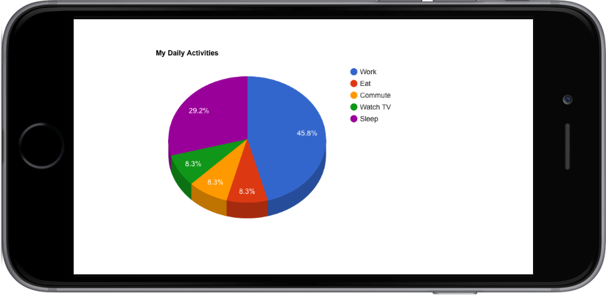

# Goolge Charts Module

Display Google Charts as static images in Corona.

chart.get("charts/scatter.html", nil, "chart.png", nil, chartListener)

-- chart.get({
--   chart_html = "charts/bubble.html",
--   chart_dir = system.ResourceDirectory,
--   dest_file = "chart.png",
--   dest_dir = system.DocumentsDirectory
-- }, chartListener)